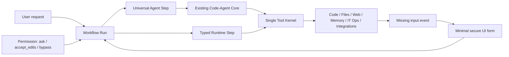

# Universal Agent Workflow — PRD

Status: implemented

Owner: product / principal engineer

Date: 2026-08-11

Evidence: `docs/ARCHITECTURE_SIMPLIFICATION_AUDIT_RU.md`

## Implementation result

Рефакторинг завершён в рабочем дереве. Итоговый контракт описан в
`docs/AGENT_ARCHITECTURE_GUIDE_RU.md`; разделы ниже сохранены как исходная
постановка задачи.

- обычный и multi-agent запуск используют общий code-agent core и единый
  `ToolExecutor`;
- Composer передаёт один режим `ask` / `accept_edits` / `bypass` всему запуску;
- в `bypass` отсутствуют внутренние approval, activation, scope, path, asset,
  LAN/SSH и risk-classification блокировки;
- лимиты шагов, wall-clock/no-progress/repetition stops и 600-секундный
  execution timeout удалены; здоровый запуск прерывает только явный Stop;
- Workflow поддерживает durable `input`, `secret`, `elevation` и `approval`
  requests с inline UI и resume того же запуска;
- Telegram, MCP/LSP, plugins, assets, IT Ops, Workflow triggers, memory и
  library управляются через единый typed `runtime_control`, а отдельные
  пользовательские панели и прямые routes удалены;
- старые Pipelines заменены interval triggers существующего Workflow engine;
  scheduler хранит их в `workflow_engine.db`, наследует permission mode и не
  создаёт второй agent loop;
- runtime operations возвращают единый `completed / failed / needs_* /
  waiting_approval / cancelled` envelope;
- секреты хранятся в переносимом AES-GCM vault; Windows Credential Manager
  доступен только как явный источник legacy-миграции;
- постоянный Windows service/helper не требуется: для шага
  `needs_elevation` Tauri запускает точную команду через системный UAC и
  возвращает результат, связанный с `request_id`;
- reasoning chip использует `none` / `low` / `medium` / `xhigh`, а запросы к
  llama.cpp всегда отправляют `cache_prompt=true`.

От исходной идеи одноразово устанавливаемого privileged helper отказались:
она создавала бы новую Windows-bound зависимость после переустановки. OS-level
UAC остаётся неизбежной границей Windows и запрашивается только когда конкретной
операции действительно нужен повышенный token.

## 1. Problem

Elira должна оставаться универсальным локальным агентом: код, файлы, web,
документы, память, локальная система, IT Ops, Telegram и интеграции. Сейчас эти
возможности частично представлены отдельными UI-разделами, HTTP surfaces,
runtime controls и совместимыми execution paths. Пользователь вынужден управлять
внутренними компонентами вместо того, чтобы сформулировать результат в чате.

IT Ops secret vault сейчас жёстко привязан к Windows Credential Manager и
per-user Windows protection. После переустановки Windows application metadata
может сохраниться, но credential values не восстанавливаются без заранее
выполненной миграции. Это неприемлемо для переносимого локального агента.

Permission policy также распределена между UI, code-agent, tool policy,
monitoring approvals, workflow steps и privileged change executor. В UI уже есть
три режима `ask`, `accept_edits`, `bypass`, но multi-agent workflow не получает
выбранный режим, а `bypass` всё равно останавливает часть high-risk, remote и
unknown действий.

## 2. Product goal

Сделать workflow единственной пользовательской моделью выполнения:

- обычный запрос — одношаговый workflow с одним universal agent;
- сложный запрос — workflow из нескольких agent/tool steps;
- все шаги используют существующий code-agent core и единый tool kernel;
- permission выбирается один раз в Composer и принадлежит всему workflow run;
- capability и integration runtimes управляются запросами агента;
- IT Ops secrets хранятся в переносимом application-owned encrypted vault без
  Windows Credential Manager, DPAPI или другого Windows-bound secret state;
- постоянный Settings UI содержит только действительно необходимые bootstrap и
  recovery параметры.

Пользователь говорит «подключи Telegram», «проверь сервер», «добавь MCP» или
«выключи интеграцию». Агент строит workflow, вызывает typed runtime operation и,
если не хватает секрета или выбора пользователя, запрашивает минимальную
структурированную форму в текущем диалоге.

## 3. Target execution model

Workflow coordinator управляет только состоянием графа, correlation IDs,
permission inheritance, retry/cancel и событиями. Он не становится вторым agent
runtime и не дублирует tool execution.

## 4. One permission control

В пользовательском workflow UI остаётся один selector с тремя режимами:

| Mode | Target behavior |
|---|---|
| `ask` | Любое действие с side effect создаёт approval и останавливает workflow до ответа пользователя. |
| `accept_edits` | Чтение и обычные обратимые изменения выполняются автоматически; destructive, remote и необратимые действия требуют approval. |
| `bypass` | Любая зарегистрированная capability может выполняться без approval interruption; workflow не должен останавливаться на risk classification, activation или remote-action prompt. |

Permission mode записывается в immutable run envelope и наследуется каждым
agent/tool/runtime step. Шаг, integration channel или модель не могут повысить
режим самостоятельно. Resume продолжает с тем же режимом; смена режима создаёт
явное событие и действует только на последующие действия.

Workflow UI — единственный источник product-level human authorization:

- в `ask` каждый side effect подтверждается inline в текущем workflow;
- в `accept_edits` UI спрашивает только действия, которые не покрыты выбранной
  auto-policy;
- выбор `bypass` в UI является blanket approval всего workflow run, поэтому
  backend не создаёт дополнительные approval/path/asset/catastrophic prompts;
- если нужны path, asset, credential или другое обязательное значение, runtime
  возвращает `needs_input`/`needs_secret`, а не скрыто блокирует действие;
- Windows UAC не является внутренним approval Elira и показывается ОС только для
  bootstrap/repair privileged helper.

### 4.1 Proposed meaning of “remove guards”

В `bypass` убираются пользовательские approval/activation запреты для всех
зарегистрированных capabilities, включая workflow-driven IT Ops и integrations.

Следующие runtime invariants сохраняются, потому что это не UX permission
prompts и не адресные/asset allowlists:

- вызов должен разрешаться в реально существующий handler и иметь синтаксически
  валидные аргументы;
- API authentication и secret isolation/redaction;
- Stop/cancellation, transport errors и observability; step/wall-clock/loop/
  no-progress limits отсутствуют;
- run journal, audit trail и honest completion status;
- process isolation privileged change executor;
- credentials остаются opaque secret references и не попадают в LLM context;
- runtime не исполняет синтаксически невалидный или несуществующий target.

Подтверждённое решение владельца продукта: `bypass` даёт agent workflow полный
machine-wide scope на Windows, отключает product-level path/asset restrictions и
не блокирует catastrophic commands. Зарегистрированные Windows/IT Ops
capabilities выполняются без approval interruption.

Сетевой runtime не применяет SSRF/host/IP allowlists: localhost, произвольный
LAN, link-local, metadata endpoints, HTTP MCP и любой SSH alias/hostname/IP
доступны агенту. Формат URL/host остаётся валидируемым только потому, что
transport не может выполнить синтаксически невалидный адрес.

Code-agent не имеет step limit, общего execution timeout, reasoning/content
runaway cut-off или no-progress termination. Повторы дают только наблюдаемую
подсказку модели. Run завершается ответом модели, Stop пользователя, физической
ошибкой транспорта либо невозможностью продолжить из-за реального context limit.
Workflow input/secret/elevation/approval requests не истекают через 300 секунд:
они ждут решения UI или Stop.

Это не может отменить Windows security token: любой процесс получает фактические
OS-права от Windows. Для административных операций используется существующий
privileged helper/change-executor. Workflow UI выполняет одноразовый UAC bootstrap
для установки или восстановления helper, после чего обычные задачи идут через
authenticated loopback IPC без per-action UAC/approval. После переустановки
Windows helper нужно зарегистрировать заново; portable application state и
secrets от Windows account не зависят.

### 4.2 Portable vault без Windows Security storage

IT Ops и integration secrets используют один переносимый encrypted vault,
принадлежащий приложению:

- никаких `CredWrite`, `CredRead`, `CredDelete`, DPAPI или Windows account
  binding для хранения и восстановления secrets;
- существующая core-зависимость `cryptography` выполняет authenticated
  encryption; рекомендуемый primitive — AES-256-GCM;
- random data key не хранится открытым и оборачивается ключом из пользовательской
  passphrase через versioned memory-hard KDF; рекомендуемый KDF — scrypt;
- смена passphrase не меняет `secret_ref` и asset/profile bindings;
- decrypted key и secret values живут только в памяти runtime и очищаются при
  lock, shutdown или timeout;
- ciphertext использует versioned envelope и authenticated metadata;
- запись атомарна и хранит восстановимую предыдущую версию;
- backup содержит encrypted vault, необходимые metadata stores и manifest, но
  никогда не plaintext secrets или unlocked key.

При первом использовании workflow возвращает inline `vault_create` или
`vault_unlock` card. Passphrase вводится в write-only field и не попадает в
transcript, model context, journal или telemetry. Recovery key сохраняется
пользователем отдельно. После переустановки Windows пользователь восстанавливает
encrypted bundle и вводит passphrase либо recovery key; прежние `secret_ref`
сохраняют identity.

Существующие WinCred credentials мигрируются только на старой системе, где они
ещё доступны: workflow читает значение внутри runtime, записывает его в portable
vault, проверяет round-trip, переключает metadata backend и только затем удаляет
WinCred entry. Потерянный после переустановки WinCred secret автоматически
восстановить невозможно; workflow запрашивает credential заново.

## 5. Workflow-owned runtime capabilities

Следующие области уходят из постоянных Settings-разделов за единый runtime
capability interface:

- integration discovery, status, configure, start, stop, restart и healthcheck;
- Telegram configure, allowed-user management, start, stop и diagnostics;
- MCP/LSP/plugin lifecycle;
- IT Ops asset discovery, enrollment, status, diagnostics и change execution;
- feature/capability enable, disable и status;
- portable vault create, unlock, lock, backup, restore, rotate, healthcheck и
  WinCred-to-portable migration;
- privileged helper install, status, repair и re-register через inline UAC flow;
- pipeline scheduling как создание или изменение workflow trigger;
- memory/library administration, когда операция может быть выражена typed tool.

Каждая runtime operation возвращает только один из результатов:

- completed с typed result;
- failed с typed error и retryability;
- needs_input со schema безопасной формы;
- needs_secret со write-only secret field;
- waiting_approval только для режимов, где approval разрешён политикой;
- cancelled.

Секреты никогда не передаются через natural-language message или model context.
Агент получает opaque reference и состояние credential.

## 6. Minimal UI

Постоянно видимые элементы:

- Composer;
- permission selector из трёх режимов;
- текущий workflow status, Stop и Resume;
- project/session selection;
- approvals только когда выбран не `bypass`;
- artifacts и requested input forms.

Минимальный Settings/Bootstrap UI:

- inference endpoint и model fallback;
- project root;
- inline workflow cards для vault create/unlock/import/recovery, write-only
  secret intake и одноразового privileged-helper bootstrap;
- аварийная диагностика и сброс runtime;
- настройка permission default.

Telegram, assets, MCP/LSP, plugins, pipelines, feature flags и детальная memory
настройка не должны требовать постоянных отдельных панелей. До достижения
runtime parity существующие панели остаются compatibility UI и удаляются по
одной после behavioral tests.

## 7. Migration strategy

1. Зафиксировать behavior contracts и usage telemetry существующих UI/API.
2. Ввести portable vault contract и fresh-install restore tests.
3. Реализовать WinCred-to-portable migration workflow до удаления старого
   backend.
4. Добавить privileged-helper bootstrap/re-register workflow для чистой Windows.
5. Добавить permission mode в canonical workflow run envelope.
6. Перевести один обычный code-agent run в одношаговый workflow без изменения
   поведения UI.
7. Перевести multi-agent steps с legacy chat adapter на typed request текущего
   code-agent core.
8. Ввести общий runtime capability result и `needs_input`/`needs_secret` events.
9. Переносить lifecycle control вертикальными срезами: Telegram, MCP/LSP/plugins,
   IT Ops, pipelines, memory/library.
10. После каждого среза переключать agent workflow, оставляя старую UI/API
   оболочку как наблюдаемый compatibility alias.
11. Удалять панель или route только после parity, нулевой telemetry и rollback
   window.
12. В конце сделать workflow path основным и удалить доказанно неиспользуемые
   legacy adapters.

## 8. Success criteria

- Любой обычный запрос идёт через workflow run, но не получает лишнюю latency от
  multi-agent planning.
- Все agent/tool/runtime steps наследуют один permission mode.
- В `bypass` нет approval pauses согласно утверждённой boundary.
- Telegram, integrations и IT Ops полностью управляются natural-language
  workflow после одноразового secure bootstrap.
- `bypass` выполняет зарегистрированные machine-wide Windows capabilities без
  product-level approval, path, asset или catastrophic-command blocks.
- Backup portable vault восстанавливается на fresh Windows installation без
  Credential Manager, DPAPI или прежнего Windows account state.
- Restore сохраняет `secret_ref` identity и connection bindings.
- Elevation всегда оформляется явным `needs_elevation` в Workflow UI и
  выполняется нативным UAC bridge.
- Vault plaintext не помещается в model context или event payload: агент
  оперирует `secret_ref`. Дочерние процессы при этом наследуют текущую среду
  процесса Elira, как обычный локальный агент с полным Windows token.
- Для каждой runtime operation есть status, cancellation и audit event;
  сетевой provider может иметь только собственный transport/protocol timeout.
- Settings UI сокращён до bootstrap/recovery параметров.
- Нет второго agent loop, executor, tool registry или DB layer.
- Existing user data сохраняются; destructive storage cleanup выполняется
  отдельно после export/quarantine.

## 9. Out of scope

- Физическое объединение всех SQLite stores.
- Удаление privileged process boundary.
- Передача секретов модели ради упрощения UI.
- Одномоментное удаление существующих Settings panels или public API.
- Новый workflow framework или второй agent runtime.
- Обход или отключение Windows kernel security model: административный helper
  всё равно получает права через Windows service token/UAC при bootstrap.
- Любая новая зависимость secret backup/restore от Windows Credential Manager,
  DPAPI, Windows account SID или machine-bound key store.
- Хранение ключа расшифровки рядом с ciphertext без passphrase/recovery wrapping.
