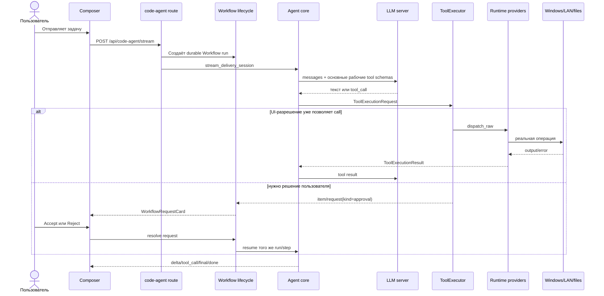

# Архитектура агента Elira — полное простое руководство

> Актуальное состояние после упрощения runtime. Обновлено 23 августа 2026 года.
> Это главный документ: что за что отвечает, куда идёт запрос, где хранятся данные,
> как работают разрешения, интеграции, Windows, UAC, Stop и локальная модель.

## 1. Самая короткая версия

Elira — не набор отдельных агентов. У неё один исполняющий core и один Workflow
control plane.

```text
Пользователь
    ↓
Composer в Workflow UI
    ├─ режим разрешений: ask | accept_edits | bypass
    └─ режим мышления: none | low | medium | xhigh
    ↓
FastAPI: /api/code-agent/stream
    ↓
Code-agent core: понять → спланировать → вызвать tool → продолжить → ответить
    ↓
Единый ToolExecutor
    ↓
Единый Runtime Registry
    ├─ основные рабочие tools с первого хода
    ├─ группы tools по запросу LLM
    ├─ SSH
    ├─ IT Ops
    ├─ MCP
    └─ LSP
    ↓
Файлы / процессы / LAN / Windows / внешние сервисы
```

Обратный поток:

```text
Результат tool / ошибка OS / запрос пользователю
    ↑
SSE events + durable Workflow events
    ↑
Transcript + Workflow request card
```

Главное правило архитектуры:

```text
один agent core
+ один executor
+ один provider registry
+ один Workflow permission selector
= предсказуемый локальный агент
```

## 2. Кто за что отвечает

| Слой | Ответственность | Главные файлы |
|---|---|---|
| Tauri | Запускает desktop, даёт нативный UAC bridge | `src-tauri/src/main.rs` |
| React UI | Composer, transcript, Stop, permission/reasoning chips, request cards | `frontend/src/workspace/` |
| API client | SSE code-agent и Workflow event stream | `frontend/src/api/codeAgent.ts`, `frontend/src/api/workflows.ts` |
| FastAPI routes | Принимают HTTP, создают stream/run, resume/cancel | `backend/app/api/routes/` |
| Delivery session | Продолжает тот же run после переполнения контекста | `application/code_agent/delivery_session.py` |
| Agent core | Диалог с LLM, tool calls, journal, context, финальный ответ | `application/code_agent/agent_loop.py` |
| Planning | Валидированный структурный план для сложной задачи | `application/code_agent/planning.py` |
| Workflow | Durable run, step, request, resume, cancel | `application/workflows/` |
| ToolExecutor | Единственная точка Workflow-разрешения и запуска tool | `application/agent_kernel/executor.py` |
| Impact policy | Только классифицирует опасность для `accept_edits` | `application/agent_kernel/impact_policy.py` |
| Runtime registry | Собирает схемы и направляет call владельцу | `application/tool_providers/runtime_registry.py` |
| Providers | Builtin, SSH, IT Ops, MCP, LSP | `application/tool_providers/` |
| Capability catalog | Группирует необязательные builtin-схемы для загрузки моделью | `application/code_agent/capabilities.py` |
| Runtime control | Управляет скрытыми интеграциями из Workflow | `application/code_agent/tools/_runtime_control.py` |
| LLM client | OpenAI-compatible HTTP, reasoning kwargs, prompt cache | `infrastructure/llm/openai_compatible.py` |
| Vault | Переносимые секреты AES-256-GCM | `infrastructure/secrets/vault.py` |
| Stores | SQLite/JSON/filesystem persistence | `application/*/store.py`, `infrastructure/*/store.py` |

## 3. Обычный запуск — по шагам



Что важно:

- модель сразу видит основные инструменты файлов/shell, поиска/чтения Web,
  памяти и `runtime_control`, а также `capability_load` и вопросы Workflow;
- дополнительные группы builtin tools выбирает сама LLM, а полные схемы группы появляются
  на следующем model turn;
- в UI существует одна личность `Elira / Auto` и единая температура; доменные
  метки нужны только для требований задачи и evidence, без переключения роли;
- MCP/LSP/SSH не запускаются из-за профиля: LLM вызывает runtime только когда
  конкретной задаче нужна соответствующая внешняя интеграция;
- большой MCP не выгружает в LLM все схемы сразу: provider оставляет только
  релевантный задаче поднабор, а `mcp_tools(server_id, query)` раскрывает другой
  поднабор без рестарта. Это экономия prompt, а не запрет: provider по-прежнему
  владеет полным набором advertised tools;
- отдельного `tool_search`, второго registry или run-scoped authorization
  allowlist нет;
- tool call не уходит в параллельный executor;
- approval не хранится во второй approval-базе;
- Resume продолжает тот же `run_id`, а не создаёт новую задачу;
- долгий корректный run не имеет wall-clock timeout или лимита шагов.
- дочерние shell/sandbox/plugin процессы наследуют текущую среду Elira и права
  текущего Windows token; отдельной скрытой env-allowlist нет.

### 3.1. Как LLM подгружает инструменты

На первом ходе модель получает одну стабильную личность и основные рабочие
схемы из `tool_policy.BASE_TOOLS`, включая `web_search`, `web_fetch`,
`runtime_control` и файловые инструменты. Их рабочие инструкции стоят перед
текущим запросом. Минимальный default только с discovery отменён 2026-09-06:
правильное выполнение важнее TTFT. Старые настройки и журналы читаются,
профиль не меняет личность или температуру. Остальные возможности подгружаются:

```text
Запрос пользователя
    ↓
Стабильное ядро Elira + история + контекст текущего запроса
    ↓
Основные рабочие схемы и инструкции; capability_load для дополнительных групп
    ↓
Evidence Router
    ├─ локальный факт → project/files/system tools
    ├─ актуальный/внешний факт → Web
    └─ неизвестность/ошибка → локальная проверка + Web
                                  ↓
                         тот же Runtime Registry / ToolExecutor
```

Примеры загрузки возможностей:

| Задача | Группа, выбираемая моделью |
|---|---|
| свободная беседа | прямой ответ, без загрузки |
| файлы, код, тесты | основные tools уже видимы |
| документы, расчёты | `resources`, `data` |
| сервер, SSH, внешние интеграции, личная память | `runtime_control` уже видим |
| внешние источники | `web_search`/`web_fetch` уже видимы; `web` для browser и остальных tools |

Legacy `profile_name` остаётся в HTTP/journal для совместимости. Новый run
начинается с основных рабочих tools; `capability_load` доступен и после ошибочного
выбора группы. Общие проверки работы и инструкции подключённого проекта
поступают также для Web/MCP/SSH/LSP. Они закреплены через существующие
`pinned_message_ids` компактора: не теряются при summary/fallback, учитываются
в бюджете и не меняют стабильный system prefix.

Модель сама вызывает Web для актуальных/внешних данных и первичных источников.
Evidence Router сохраняет восстановление после первой внешней или
второй локальной неудачи. Если черновик модели заканчивается «не знаю / не
уверен / нет данных / не удалось», оркестратор делает один evidence-проход через
официальную документацию/первичный источник до финального ответа. Интернет не
заменяет локальную проверку файлов, Windows, сервера или сети.

| Группа | Что появляется |
|---|---|
| `project` | файлы, код, shell, процессы, тесты, план задачи |
| `runtime` | MCP/LSP/SSH/IT Ops, Telegram, Library, личная память |
| `web` | поиск/чтение web, HTTP API, browser, URL screenshot |
| `desktop` | локальный Windows computer control |
| `resources` | вложения, OCR/vision, DOCX/XLSX/PDF, публикация файлов |
| `data` | sandbox, regex, CSV, converter, SQLite, encryption, archives |
| `memory` | recall и remember |
| `operations` | server-facts reconciliation, webhooks |

Это не permission и не guard. `capability_load` лишь уменьшает prompt: handler
и ToolExecutor остаются теми же. Если валидный native/inline call скрытого
builtin всё же пришёл от модели, registry не отвечает `unknown tool`, а передаёт
его каноническому handler. Группа остаётся видимой до конца текущего `run_id`,
переживает автоматическое продолжение и Resume. Новый run снова начинается с
основного рабочего набора; unload внутри run пока не нужен.

Фактический набор и его token cost публикуются в `context_prepared`; статические
числа в документации намеренно не фиксируются, потому что schemas меняются.

Живой Unity-прогон 2026-08-27 показал эффект MCP schema routing на одной и той
же read-only задаче: максимум tool-context снизился с 31 058 до 11 917 токенов,
максимальный TTFT — со 129,8 до 54,3 секунды. Цепочка вызовов и ответ редактора
остались теми же.

### 3.1.1. Управляемые фоновые задания

`run_server` остаётся одним canonical process runtime, но поддерживает два вида:

```text
короткая typed-операция
  → обычный tool call до результата

долгая конечная команда без typed tool
  → run_server(start, kind=job, command=...)
  → до Popen: redacted starting-запись в journal
  → PID возвращается сразу
  → worker публикует launch sidecar (PID + creation identity)
  → Windows: отдельная process group + detached console + Job Object breakaway
  → raw-команда удаляется вместе с коротким spec
  → worker пишет exit sidecar независимо от backend
  → run_server(logs, pid) показывает running/completed/failed/cancelled и вывод
  → run_server(stop, pid) или Workflow Stop убивает дерево процесса

backend restart
  → data/background_jobs/jobs.json
  → повреждённый journal уходит в quarantine, а не перезаписывается
  → сверка PID + creation identity (защита от PID reuse)
  → повторное подключение к прежнему log/result sidecar
  → тот же run_server(list/logs/stop), новый executor не создаётся

dev server / watcher
  → run_server(start, kind=server, command=..., port=...)
```

Глобального тайм-аута нет. Завершённый job сохраняет финальный лог, exit code и
terminal-state в ограниченном по TTL/числу machine-local journal, поэтому LLM
не теряет результат между опросами и рестартами backend. Если PID исчез без
sidecar, запись честно становится `failed` с неизвестным exit code. При явном
Stop записывается `cancelled`. Активные jobs не переносятся в portable backup:
PID и пути относятся только к текущей Windows/Linux-машине.
Фоновый режим не заменяет транспортные тайм-ауты: например, TCP scanner всё равно
использует свой `connect_timeout`.

### 3.2. Как агент узнаёт о подключённой папке проекта

Отдельный helper/«второй помощник» не нужен. Путь проходит через один явный
контракт и попадает в каждый новый запрос модели:

```text
Пользователь выбирает папку в Composer
    ↓
UI сохраняет projectRoot в текущей code-agent session
    ↓
Следующий Send передаёт project_root в FastAPI
    ↓
backend заново собирает system prompt этого run
    ├─ «Текущая директория проекта: <абсолютный путь>»
    └─ «Проект подключён» + правила работы с файлами
    ↓
LLM уже на первом ходе знает корень и использует glob/read_file/search/edit
```

Если папку подключили посреди разговора, сигнал появится со следующим сообщением:
между сообщениями модель не работает, поэтому отдельное скрытое сообщение ничего
не ускорит, а только создаст второй источник состояния. Без реального проекта
backend явно подставляет scratch workspace и противоположный блок «проект не
подключён».

## 4. Multi-agent — не второй агентный движок

Multi-agent — это Workflow-шаблон, который последовательно вызывает тот же core.

```text
Composer «Мульти-агент»
    ↓
/api/advanced/multi-agent/stream
    ↓
workflow_engine.db: template → run → steps
    ↓
step_executor
    ↓
chat.runtime compatibility adapter
    ↓
тот же run_code_agent
    ↓
тот же ToolExecutor и Runtime Registry
```

Workflow может поставить run в `needs_input`, `needs_secret`, `needs_elevation`
или `waiting_approval`. После решения карточки coordinator продолжает именно этот
step. Пока step ждёт, HTTP stream живёт на keepalive и не обрывается по таймеру.

## 5. Единственное продуктовое разрешение

Permission выбирается одним chip в Composer и записывается в Workflow run.

| Режим | Чтение | Обычные изменения | Опасные/неизвестные изменения |
|---|---:|---:|---:|
| `ask` | автоматически | Workflow card | Workflow card |
| `accept_edits` | автоматически | автоматически | Workflow card |
| `bypass` | автоматически | автоматически | автоматически |

`bypass` означает отсутствие внутренних product approvals. Он не создаёт права
администратора Windows и не делает недоступный provider доступным.

`accept_edits` использует impact classifier. Он не запрещает действие, а только
решает, нужна ли карточка Workflow. Примеры высокой опасности: удаление данных,
форматирование диска, изменение firewall/routes/SSH access, destructive git,
остановка системных служб, произвольный код в editor bridge.

Удалены как authorization layers:

- internal ApprovalStore;
- `forbidden` tier;
- tool activation/deferred tool set;
- operation scopes;
- path/asset authorization scopes;
- SSH/LAN allowlists;
- feature gates перед tool dispatch;
- tool execution timeout;
- run wall-clock timeout;
- max steps/max iterations/no-progress/repetition self-stop.

Старые колонки `permission`, `scopes`, `timeout_seconds`, `policy_classified` могут
оставаться в `tool_registry.db` для чтения старой базы. Executor их не использует
как разрешение или дедлайн.

## 6. Workflow events и запросы

Четыре публичных типа запроса:

| `kind` | Когда нужен | Что возвращает UI |
|---|---|---|
| `input` | Не хватает выбора/значения | JSON по указанной schema |
| `secret` | Нужен пароль/token/key | Только непрозрачный `secret_ref` |
| `elevation` | Windows требует повышенный token | Подписанный результат Tauri UAC bridge |
| `approval` | Режим разрешений требует подтверждения | Accept/Reject точного tool call |

Событийная цепочка:

```text
item/started
    ↓
item/request
    ↓
Workflow UI card
    ↓
serverRequest/resolved
    ↓
item/completed
```

Durable request хранится в `workflow_engine.db`. UI получает его двумя путями:

```text
snapshot: GET /api/agent-os/workflow-requests?status=actionable
live:     GET /api/agent-os/events/stream
```

Это позволяет восстановить карточку после перезапуска UI.

## 7. Stop и реальные причины завершения

Для здорового запуска пользовательский Stop — единственный product-level
прерыватель.

```text
Stop
  ├─ ставит cancel event agent run
  ├─ отменяет Workflow run
  ├─ синхронно закрывает upstream HTTP Response модели
  │  (планирование, сжатие истории или основной ответ)
  ├─ после ответа cancel endpoint закрывает UI SSE reader
  └─ убивает зарегистрированное дерево shell-процесса
```

Нет:

- `execution timed out after 600s`;
- SSE inactivity timeout;
- `max_steps reached`;
- no-progress/loop/repetition guard stop;
- auto-stop фонового `run_server` при финальном ответе.

Технически run всё ещё может завершиться по объективной ошибке:

- сервер модели недоступен или оборвал соединение;
- OS вернула ошибку запуска/доступа;
- MCP/LSP/SSH transport не подключился;
- запрос не помещается в физическое context window после compaction;
- provider вернул невалидный protocol payload;
- приложение/процесс аварийно завершился.

Это не внутренние запреты. Это фактические failure boundaries.

## 8. Интеграции спрятаны за runtime

В Settings больше не нужен отдельный пульт на каждую интеграцию. Агент вызывает
`runtime_control(operation, ...)`, а Workflow показывает нужную карточку.

```text
Агент
  ↓ runtime_control
Runtime control adapter
  ├─ Vault
  ├─ MCP lifecycle/config
  ├─ LSP lifecycle/config
  ├─ SSH saved shortcuts
    ├─ Telegram lifecycle/config/users/send/messages (token только внутри vault/runtime)
  ├─ IT Ops assets/profiles
  ├─ Plugins lifecycle/config/run
  ├─ Workflow templates/runs/triggers/scheduler
  ├─ Memory administration
  └─ Library administration
```

Поддерживаемые группы операций:

- `status`;
- `mcp_list/upsert/remove/start/stop/restart`;
- `lsp_list/upsert/remove/start/stop/restart`;
- `ssh_hosts/set_hosts` — только сохранённые shortcuts, не ограничение целей;
- `telegram_status/configure/start/stop/test/users/toggle_user`;
- `itops_assets`, asset/profile upsert/remove;
- `itops_mikrotik_list/upsert/remove/sync` — постоянный multi-router roster;
- `plugin_list/info/enable/disable/reload/configure/run`;
- `workflow_list/upsert/remove/run/runs/resume/cancel`;
- `workflow_trigger_list/upsert/remove` и `workflow_scheduler_status/start/stop`;
- `memory_stats/profiles/list/search/recall/add/delete/prune`;
- `library_list/search/read/context/add/import/toggle/delete`: поиск возвращает
  `file_id`, а `library_read(offset, limit)` последовательно читает полный текст;
- `vault_status/lock/backup/restore`.

Library в topbar — долговременная база, а не второе чат-вложение. Файл можно
загрузить прямо в popover или явно сохранить туда из attachment-chip. При
ингесте сохраняется полный извлечённый текст до физического предела 1 000 000
символов и индексируется FTS5 внутри существующей `library.db`; в обычный prompt
попадает только релевантное окно до 2500 символов. Нулевое совпадение не
подмешивает старые документы в обычный чат; fallback разрешён только при явном
запросе к Library/вложению/документу.
Если запрос требует прочитать документ целиком, агент выполняет
`library_search`, затем повторяет `library_read` с возвращаемым `next_offset`.
UI показывает `проиндексирован / только превью / ошибка индексации`, активность
и факт предыдущего добавления в контекст.

Старый отдельный Pipeline API не возвращён. Расписание — это запись
`workflow_triggers` в той же `workflow_engine.db`; триггер запускает существующий
Workflow и наследует один из трёх permission modes.

Каждая операция возвращает единый envelope:

```text
completed(result)
failed(error.code, error.message, error.retryable)
needs_input(request.schema)
needs_secret(write-only card)
needs_elevation(UAC command)
waiting_approval(exact tool digest)
cancelled
```

Публичная точка одна, но файл не превращён в новый монолит: общий result contract
лежит в `_runtime_control_contract.py`, Workflow/scheduler adapter — в
`_runtime_control_workflows.py`, memory/library adapter — в
`_runtime_control_data.py`. Они не исполняют tools сами и не создают второй
registry.

FastAPI не запускает MCP автоматически. В начале обычного прогона MCP/LSP не
добавляют схемы в prompt; infrastructure intent заранее раскрывает typed IT Ops
и SSH. Если задача требует внешнюю интеграцию, модель действует явно:

```text
MCP: runtime_control(mcp_list)
  → runtime_control(mcp_start, server_id)
  → schemas только выбранного MCP на следующем model turn

LSP: runtime_control(lsp_list)
  → runtime_control(lsp_start, server_id)
  → три LSP tools текущего прогона

SSH: runtime_control(ssh_hosts)
  → SSH tools текущего прогона

IT Ops вне профиля Инфраструктура: runtime_control(itops_assets)
  → IT Ops tools текущего прогона по решению LLM

Новый MikroTik: runtime_control(itops_mikrotik_upsert, host, user, label,
                                ros_version?, ssh_alias?, identity_file?)
  → network_device + ssh profile в it_ops.sqlite3
  → typed SSH probe автоматически определяет/проверяет RouterOS
  → RouterOS 6 получает legacy algorithms только для этой зарегистрированной цели

Сохранённый MikroTik: runtime_control(itops_mikrotik_list)
  → itops_mikrotik_inventory с точным router_id
  → произвольная RouterOS CLI-команда через ssh_run
```

Адрес, имя, версия, key path и параметры всех добавленных MikroTik переживают
новые чаты и перезапуск приложения. Каноническая запись находится в IT Ops
store. MikroMCP и `routers.yaml` удалены. Typed SSH использует OpenSSH key или
ssh-agent; пароль и содержимое private key никогда не передаются модели/tool.

Сетевой/серверный intent подключает внутреннюю политику `Инфраструктура`, typed
IT Ops, SSH и Web уже на первом model turn независимо от прежнего сохранённого
профиля. Это не permission и не guard: вызов проходит через тот же provider,
ToolExecutor и режим Workflow. Для TCP-проверок модель должна использовать
`itops_network_inventory` с `/32` для одного IP, явными портами,
`connect_timeout` и `concurrency`, а не последовательный `Test-NetConnection`
через shell.

Обычные SSH-команды запускаются с нативным `ssh -n`: если ошибочная удалённая
команда попробует читать stdin, она сразу получит EOF и не повесит Workflow.
`ssh_write` отдельно передаёт содержимое через stdin и поэтому не использует `-n`.
IT Ops использует тот же общий SSH argv-builder, поэтому typed diagnostics также
получают `-n` и `ConnectTimeout`, а не поддерживают отдельную копию transport flags.

Даже если другой прогон уже держит MCP-процесс запущенным, его сотни схем не
попадут в текущий prompt без выбора этого `server_id` текущим агентом.
Выбор записывается в journal прогона и сохраняется между его автоматическими
продолжениями и Resume; новый прогон начинает с пустого набора интеграций.

Счётчик контекста учитывает не только сообщения, но и точные schemas активных
tools. Поэтому большой выбранный MCP виден в UI/телеметрии и не маскируется как
«пустой» чат.

### 8.1. Corpus ingestion — временная RAG-база веб-источников

Corpus не загружает интернет автоматически и не является долговременной памятью.
Он появляется только по решению модели после загрузки группы `web`:

```text
web_fetch(url, store=true)
    ↓ fetch + повторная SSRF-проверка redirects + лимит 8 MB
HTML / text / PDF / DOCX
    ↓ очистка и canonical text
chunks около 1 400 символов
    ↓
web_corpus.sqlite3, изоляция по run_id
    ↓
web_query(query) → BM25 → optional embedding rerank
    ↓
quote + source URL + exact offset/hash verification
```

Лимиты: до 40 документов/15 MB на run, глобально до 200 документов/60 MB, TTL
7 дней. Веб-текст всегда помечен как недоверенные данные, а не инструкции. Если
Corpus пуст, `web_query` честно просит сначала выполнить
`web_fetch(store=true)`. Нужный источник можно явно закрепить в Library; сам
Corpus остаётся одноразовым кэшем текущего run.

### 8.2. Project Corpus — постоянный индекс локальных репозиториев

Project Corpus работает отдельно от временного web Corpus и использует уже
существующий `rag_memory.db`:

```text
выбранная папка проекта / папка с несколькими repo
    ↓ рекурсивное обнаружение Git-репозиториев
git ls-files --cached --others --exclude-standard
    ↓ tracked + неигнорируемые untracked-файлы
текстовые source/config/docs до 200 KB
    ↓ SHA-256 файла + chunks по 80 строк с overlap 10
embedding endpoint
    ↓
rag_items: chunk + vector + source_uri/source_hash
project_corpus_files: status/hash/mtime/chunk_count
    ↓
scoped hybrid search → text + file/lines + repo/commit/language
```

Корнем corpus считается выбранная папка. Если в ней лежат `repo-a`, `repo-b` и
`repo-c`, один поиск видит все три, но chunks остаются изолированы от corpus с
другим `project_root` через стабильный `project_scope_id`.

Повторная кнопка «Индексировать проект» не перестраивает embeddings целиком:
совпавшие SHA-256 пропускаются, новая версия файла сначала индексируется под
новым hash, затем старая удаляется. Удалённые файлы удаляются из manifest и RAG.
Ошибка оставляет статус `failed`; следующий запуск продолжает её. Лимит 5000
chunks ограничивает один проход, а не общий размер corpus: следующий запуск
пропускает готовые файлы и продолжает дальше. Если Git не смог построить полный
snapshot, reconciliation не запускается и предыдущий индекс сохраняется.

### 8.3. Память пользователя — жизненный цикл без смешивания stores

```text
явный факт пользователя
    ↓ memory facade
smart_memory.db                  ← curated facts
    ├─ повтор факта → один id, importance растёт
    ├─ memory_search → id → user_correction(replaces_id) → старая строка заменяется
    └─ volatile_fact → не source of truth, удаляется age-prune

эпизод / Project Corpus
    ↓
rag_memory.db                    ← semantic/project records

web_fetch(store=true)
    ↓
web_corpus.sqlite3               ← временный run-scoped кэш, не память
```

`memory_prune` объединяет два независимых обслуживания: bounded prune
семантических `agent_turn/verified_turn` и удаление только устаревших
`volatile_fact` (по умолчанию старше 7 дней). Обычные пользовательские факты
эта операция не удаляет. `runtime_control(memory_search)` показывает ID
найденных curated facts, не смешивая этот lookup с Project RAG. Поэтому для
поправки агент передаёт `source=user_correction` и явный `replaces_id`: прежняя
запись заменяется даже при полном перефразировании, а ID из другого профиля не
принимается. Лексический same-topic поиск оставлен только как совместимый
fallback для старых callers без `replaces_id`.

Детерминированный Harness запускает весь цикл в отдельном временном
`ELIRA_DATA_DIR`, без LLM, сети и пользовательских баз. Он проверяет шесть
контрактов: CRUD, correction, dedup, volatile lifecycle, изоляцию трёх контуров
и encrypted backup/restore.

Любой текст беседы использует тот же рабочий набор, что и работа. Регулярки
приветствий/комплиментов и отдельный разговорный путь удалены. После рабочего
run следующая беседа снова получает основные tools и их инструкции. Дополнительные
инструкции не переносятся в обычную историю ответов; развитие личности, предпочтения и
релевантная память добавляются отдельно после стабильного начала.

Настроение считывается один раз на прогон и добавляется к текущему сообщению
после истории. Оно больше не меняет начало системного промпта и схем инструментов:
переход «ровная» → «оживлённая» сохраняет общий префикс для KV-кеша.
Переключение thinking остаётся отдельной причиной промаха кеша: текущий шаблон
Qwen вставляет инструкцию reasoning effort в начало system. Стоимость холодного
запроса и переключения thinking измеряется отдельно; TTFT не ограничивает работу.

DRY-антиповторы ограничены последними 1024 токенами; в коротком ответе это окно
захватывает и историю. Поэтому допустимая длина повторения увеличена с 2 до 12
токенов: A/B на одинаковой истории и seed показал, что прежний штраф искажал имя
Elira при повторных вопросах. Это общая настройка для беседы и работы; длинные
повторы по-прежнему штрафуются, списков исключений для фраз не добавлено.

## 9. Windows, права и UAC

Обычные действия выполняются с текущим Windows security token процесса Elira.

```text
Elira запущена обычным пользователем
    ↓
tool получает те же права, что Elira
    ├─ доступ разрешён Windows → выполняется
    └─ нужен admin token → Access denied / elevation request
```

Elira не зависит от постоянного запуска «от администратора», Credential Manager
или DPAPI. Если конкретная команда требует admin token:

```text
agent → workflow_request(kind=elevation)
      → UI показывает карточку
      → Tauri вызывает Windows UAC
      → отдельный elevated helper выполняет ровно эту команду
      → результат привязывается к request_id
      → Workflow продолжает run
```

UAC нельзя честно «обойти». Можно только запросить у Windows новый повышенный
token через штатный диалог. Переустановка Windows не ломает данные агента, если
сохранены runtime data и passphrase/recovery key переносимого vault.

## 10. Секреты и переносимый vault

Активный vault:

- файл: `data/portable_vault.json`;
- encryption: AES-256-GCM;
- passphrase KDF: scrypt;
- в Workflow и tool args передаётся только `sref_...`;
- plaintext не пишется в events, journal, prompt или SQLite;
- decrypted data key автоматически удаляется из памяти после периода
  неактивности (`ELIRA_VAULT_IDLE_TIMEOUT_SECONDS`, по умолчанию 900 секунд);
- WinCred читается только явной legacy migration операцией.
- пользовательский backup включает `smart_memory.db` и `rag_memory.db`, поэтому
  переносит curated/semantic memory и Project Corpus;
- `web_corpus.sqlite3` в backup не входит: это одноразовый кэш источников run.

```text
Secret card → vault.write(plaintext) → secret_ref
                                     ↓
tool args содержат только secret_ref
                                     ↓
owning runtime разрешает ref в памяти перед I/O
```

## 11. Мышление Qwen

UI всегда показывает четыре значения:

| Chip | Qwen3.8 |
|---|---|
| `none` / Выкл | `enable_thinking=false`, effort `none` |
| `low` / Коротко | `enable_thinking=true`, effort `low` |
| `medium` / Средне | `enable_thinking=true`, effort `medium` |
| `xhigh` / Макс | `enable_thinking=true`, effort `xhigh` |

Backend отправляет параметры Qwen:

```text
Qwen: enable_thinking + reasoning_effort
```

Выбранный уровень используется и на planning call, и на следующих execution /
verification calls. MTP у Qwen независим от reasoning chip: это ускорение
генерации на стороне inference server, а не уровень интеллекта.

В model payload всегда ровно один `system`, и он стоит первым. Сжатая история,
проверенные факты и вывод tools прошлого хода передаются как явно помеченный
assistant-shaped runtime context. Это сохраняет данные, но не нарушает строгий
Qwen chat template с ошибкой `System message must be at the beginning`.

## 12. Prompt cache

Каждый chat payload содержит:

```json
{"cache_prompt": true}
```

`n_prompt_tokens_cache=0` не означает, что Elira выключила cache. Это означает,
что конкретный server request не переиспользовал ни одного prompt token. Частые
причины:

- первый запрос после загрузки модели;
- server slot/cache был очищен или заменён;
- начало prompt изменилось;
- запрос попал в другой slot;
- модель/context/template были переключены;
- сервер не смог совместить текущий prefix с сохранённым prefix.

Исправлять сам флаг нужно в agent LLM client, а качество cache hit — в slot/cache
на inference server. В текущем агенте флаг уже включён.

## 13. API — что реально смонтировано

Все router owners перечислены в `backend/app/api/routes/registry.py`.

| Prefix | Назначение |
|---|---|
| `/api/code-agent` | stream/resume/cancel, sessions, project prompt, RAG helpers |
| `/api/agent-os` | Workflow templates/runs/requests, event SSE, portable vault |
| `/api/advanced` | multi-agent Workflow, projects, advanced RAG |
| `/api/media` | durable resource intake |
| `/api/lib` | curated library |
| `/api/chat-agent` | memory compatibility API |
| `/api/models`, `/api/profiles`, `/api/persona` | model/persona reads |
| `/api/skills` | document/SQL/HTTP/skill endpoints |
| `/api/voice` | STT/TTS |
| `/api/elira` | settings and legacy chat persistence |
| `/api/drift` | live server-fact drift status |

Прямые публичные routers для tool registry execution, terminal, Telegram, IT Ops,
assets, plugin execution, Task Planner CRUD, pipelines и change executor удалены
из active registry. Их capabilities вызываются через Workflow/runtime.

## 14. Базы и файлы данных

Корень: `ELIRA_DATA_DIR`, иначе repo `data/`.

| Store | Что хранит | Владелец |
|---|---|---|
| `workflow_engine.db` | templates, runs, steps, requests, interval triggers | `application/workflows` |
| `tool_registry.db` | tool inventory/metadata и handler names | `application/tool_registry` |
| `task_planner.db` | checklist и subagent records | `application/task_planner` |
| `code_agent_sessions.db` | UI sessions и task ledger | `code_agent/sessions.py` |
| `agent_monitor.db` | metrics и model profiles | `application/monitoring` |
| `event_bus.db` | durable events/messages/subscriptions | `application/event_bus` |
| `it_ops.sqlite3` | assets, connection profiles, evidence | `infrastructure/it_ops` |
| `integrations.db` | Telegram config/users/log | `application/telegram` |
| `smart_memory.db` | curated facts | `application/smart_memory` |
| `rag_memory.db` | embeddings/episodic memory + Project Corpus chunks и file manifest | `application/rag_memory` + `code_agent/indexing.py` |
| `library.db` | attached/curated library records | `infrastructure/db/library_db.py` |
| `projects.db` | saved project roots | `application/advanced/projects_registry.py` |
| `web_corpus.sqlite3` | untrusted web documents/chunks | `infrastructure/web_corpus` |
| `elira_state.db` | settings, persona, legacy chats/messages | `application/elira_memory` |
| `drift_facts.db` | last verified inference-server facts | `application/drift` |

Другие durable paths:

```text
.agent/runs/<run_id>/      code-agent journal
data/resources/            resource blobs + metadata
data/background_jobs/      machine-local job journal/spec/launch/result sidecars
data/mcp_servers.json      MCP configuration
data/lsp_servers.json      LSP configuration
data/ssh_acl.json          legacy filename; saved SSH shortcuts, не ACL gate
data/portable_vault.json   encrypted portable vault
```

Не объединять эти stores механически: у Workflow, memory, raw resources, IT Ops
evidence и audit events разные lifecycle и recovery semantics.

## 15. Что осталось из «защит» и почему это не блокеры

Оставлены только технические проверки корректности:

| Проверка | Зачем нужна |
|---|---|
| JSON/schema validation | Не передать provider сломанные аргументы |
| UTF-8/no-BOM validation | Не испортить русские строки и исходники |
| Secret redaction | Не записать plaintext в журнал/события |
| Output truncation | Не переполнить физическое context window одним log dump |
| Context compaction | Продолжить run в конечном окне модели |
| API bearer auth для LAN | Не открыть удалённое выполнение любому устройству в сети |
| UAC result binding | Не принять поддельное `elevated=true` по HTTP |
| Provider protocol validation | Не считать мусор успешным результатом |
| File/path syntax validation | Не передавать OS невалидный путь |

Они не создают второй approval и не запрещают валидную цель агента.

## 16. Где менять поведение

| Хочу изменить | Менять здесь |
|---|---|
| Permission modes | `agent_kernel/impact_policy.py`, `agent_kernel/executor.py`, `Composer.tsx` |
| Stop/cancel | `agent_loop.py`, `delivery_session.py`, `code_agent_routes.py`, `_shell.py` |
| Reasoning chip | `Composer.tsx`, `agent_loop.py` |
| LLM payload/cache | `infrastructure/llm/openai_compatible.py` |
| Новый built-in tool | `capabilities.py` + существующие `tool_schemas.py`/`_dispatch.py`, без второго registry |
| Новый provider | `application/tool_providers/`, зарегистрировать в runtime registry |
| Integration control | `_runtime_control.py` |
| Workflow request | `workflows/request_lifecycle.py`, `request_recovery.py`, `request_validation.py`, `WorkflowRequestCard.tsx` |
| Vault/UAC | `infrastructure/secrets/vault.py`, `src-tauri/src/main.rs` |
| API mount | `api/routes/registry.py` |

## 17. Быстрая диагностика

### Агент долго думает

Это нормально для `xhigh`. Смотрите SSE heartbeat и server tokens/sec. Не добавляйте
run timeout. Для скорости переключите chip на `medium/low`, не ломая runtime.

### `n_prompt_tokens_cache=0`

Проверьте server slot/cache и стабильность prefix. В agent payload `cache_prompt`
уже включён.

### Tool не появился

Для основного встроенного tool проверьте `tool_policy.BASE_TOOLS` и фактические
схемы первого запроса; для дополнительного — успешный `capability_load(group)`.
Для MCP проверьте `runtime_control(mcp_list/start)`. В обоих случаях registry
обновляется на следующем turn; выбранное состояние видно в journal run.

### Windows вернула Access denied

Это граница текущего token. Агент должен запросить `elevation`, а пользователь —
подтвердить UAC card.

### Stop не убил дочерний процесс

Проверяйте, прошёл ли запуск через canonical `run_bash/run_server` и зарегистрирован
ли process в run registry. Не добавляйте параллельный `subprocess.run` executor.

## 18. Инварианты для будущих изменений

1. Не добавлять второй agent loop.
2. Не добавлять второй tool executor.
3. Не добавлять provider-specific approvals.
4. Не возвращать internal scopes/allowlists/feature activation gates.
5. Не добавлять product timeout или max steps.
6. Интеграции управляются через Workflow/runtime, не отдельными Settings-пультами.
7. Секрет в model/tool/event payload — только `secret_ref`.
8. Windows elevation — только через Workflow card + native Tauri UAC bridge.
9. Основные рабочие tools видимы сразу, дополнительные группы загружает модель.
   Legacy persona profile не меняет набор основных tools или температуру.
10. Один финальный ответ или явный Stop; объективная provider/OS error остаётся честной ошибкой.
