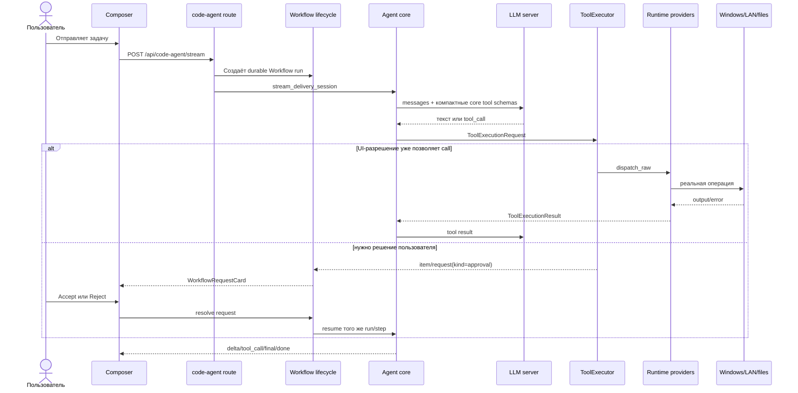

# Архитектура агента Elira — полное простое руководство

> Актуальное состояние после упрощения runtime. Обновлено 23 августа 2026 года.
> Это главный документ: что за что отвечает, куда идёт запрос, где хранятся данные,
> как работают разрешения, интеграции, Windows, UAC, Stop и локальная модель.

## 1. Самая короткая версия

Elira — не набор отдельных агентов. У неё один исполняющий core и один Workflow
control plane.

```text
Пользователь
    ↓
Composer в Workflow UI
    ├─ режим разрешений: ask | accept_edits | bypass
    └─ режим мышления: none | low | medium | xhigh
    ↓
FastAPI: /api/code-agent/stream
    ↓
Code-agent core: понять → спланировать → вызвать tool → продолжить → ответить
    ↓
Единый ToolExecutor
    ↓
Единый Runtime Registry
    ├─ компактное ядро встроенных tools
    ├─ группы tools по запросу LLM
    ├─ SSH
    ├─ IT Ops
    ├─ MCP
    └─ LSP
    ↓
Файлы / процессы / LAN / Windows / внешние сервисы
```

Обратный поток:

```text
Результат tool / ошибка OS / запрос пользователю
    ↑
SSE events + durable Workflow events
    ↑
Transcript + Workflow request card
```

Главное правило архитектуры:

```text
один agent core
+ один executor
+ один provider registry
+ один Workflow permission selector
= предсказуемый локальный агент
```

## 2. Кто за что отвечает

| Слой | Ответственность | Главные файлы |
|---|---|---|
| Tauri | Запускает desktop, даёт нативный UAC bridge | `src-tauri/src/main.rs` |
| React UI | Composer, transcript, Stop, permission/reasoning chips, request cards | `frontend/src/workspace/` |
| API client | SSE code-agent и Workflow event stream | `frontend/src/api/codeAgent.ts`, `frontend/src/api/workflows.ts` |
| FastAPI routes | Принимают HTTP, создают stream/run, resume/cancel | `backend/app/api/routes/` |
| Delivery session | Продолжает тот же run после переполнения контекста | `application/code_agent/delivery_session.py` |
| Agent core | Диалог с LLM, tool calls, journal, context, финальный ответ | `application/code_agent/agent_loop.py` |
| Planning | Валидированный структурный план для сложной задачи | `application/code_agent/planning.py` |
| Workflow | Durable run, step, request, resume, cancel | `application/workflows/` |
| ToolExecutor | Единственная точка Workflow-разрешения и запуска tool | `application/agent_kernel/executor.py` |
| Impact policy | Только классифицирует опасность для `accept_edits` | `application/agent_kernel/impact_policy.py` |
| Runtime registry | Собирает схемы и направляет call владельцу | `application/tool_providers/runtime_registry.py` |
| Providers | Builtin, SSH, IT Ops, MCP, LSP | `application/tool_providers/` |
| Capability catalog | Группирует необязательные builtin-схемы для загрузки моделью | `application/code_agent/capabilities.py` |
| Runtime control | Управляет скрытыми интеграциями из Workflow | `application/code_agent/tools/_runtime_control.py` |
| LLM client | OpenAI-compatible HTTP, reasoning kwargs, prompt cache | `infrastructure/llm/openai_compatible.py` |
| Vault | Переносимые секреты AES-256-GCM | `infrastructure/secrets/vault.py` |
| Stores | SQLite/JSON/filesystem persistence | `application/*/store.py`, `infrastructure/*/store.py` |

## 3. Обычный запуск — по шагам



Что важно:

- модель сразу видит компактное ядро, `capability_load` и `runtime_control`;
- нужную группу builtin tools выбирает сама LLM, а полные схемы группы появляются
  на следующем model turn;
- схемы MCP/LSP/SSH/IT Ops добавляются в текущий прогон только после явного
  runtime-запроса модели;
- отдельного `tool_search`, второго registry или run-scoped authorization
  allowlist нет;
- tool call не уходит в параллельный executor;
- approval не хранится во второй approval-базе;
- Resume продолжает тот же `run_id`, а не создаёт новую задачу;
- долгий корректный run не имеет wall-clock timeout или лимита шагов.
- дочерние shell/sandbox/plugin процессы наследуют текущую среду Elira и права
  текущего Windows token; отдельной скрытой env-allowlist нет.

### 3.1. Как LLM подгружает инструменты

На первом ходе обычной технической задачи модель получает 12 builtin tools
ядра и два loop-owned tools (`ask_user`, `workflow_request`). В ядре остаются
файлы, поиск по проекту, shell, checklist/delegation и два диспетчера:

```text
Задача пользователя
    ↓
LLM видит компактный каталог групп в схеме capability_load
    ├─ хватает ядра → сразу выполняет задачу
    └─ нужна возможность → capability_load(group)
                              ↓
                         Runtime Registry пересобирает schemas
                              ↓
                         следующий model turn видит tools группы
```

| Группа | Что появляется |
|---|---|
| `web` | поиск/чтение web, HTTP API, browser, URL screenshot |
| `desktop` | локальный Windows computer control |
| `resources` | вложения, OCR/vision, DOCX/XLSX/PDF, публикация файлов |
| `data` | sandbox, regex, CSV, converter, SQLite, encryption, archives |
| `memory` | recall и remember |
| `operations` | background server, server-facts reconciliation, webhooks |

Это не permission и не guard. `capability_load` лишь уменьшает prompt: handler
и ToolExecutor остаются теми же. Если валидный native/inline call скрытого
builtin всё же пришёл от модели, registry не отвечает `unknown tool`, а передаёт
его каноническому handler. Группа остаётся видимой до конца текущего `run_id`,
переживает автоматическое продолжение и Resume. Новый run снова начинается с
ядра; unload внутри run пока не нужен.

По текущему грубому счётчику `chars / 4` полный builtin-набор вместе с двумя
loop-owned schemas занимает около `8 771` токена. Стартовое ядро — около `2 470`
токенов, то есть примерно на 72% меньше. После загрузки учитываются точные схемы
фактически выбранных групп; UI получает это в `context_prepared`.

## 4. Multi-agent — не второй агентный движок

Multi-agent — это Workflow-шаблон, который последовательно вызывает тот же core.

```text
Composer «Мульти-агент»
    ↓
/api/advanced/multi-agent/stream
    ↓
workflow_engine.db: template → run → steps
    ↓
step_executor
    ↓
chat.runtime compatibility adapter
    ↓
тот же run_code_agent
    ↓
тот же ToolExecutor и Runtime Registry
```

Workflow может поставить run в `needs_input`, `needs_secret`, `needs_elevation`
или `waiting_approval`. После решения карточки coordinator продолжает именно этот
step. Пока step ждёт, HTTP stream живёт на keepalive и не обрывается по таймеру.

## 5. Единственное продуктовое разрешение

Permission выбирается одним chip в Composer и записывается в Workflow run.

| Режим | Чтение | Обычные изменения | Опасные/неизвестные изменения |
|---|---:|---:|---:|
| `ask` | автоматически | Workflow card | Workflow card |
| `accept_edits` | автоматически | автоматически | Workflow card |
| `bypass` | автоматически | автоматически | автоматически |

`bypass` означает отсутствие внутренних product approvals. Он не создаёт права
администратора Windows и не делает недоступный provider доступным.

`accept_edits` использует impact classifier. Он не запрещает действие, а только
решает, нужна ли карточка Workflow. Примеры высокой опасности: удаление данных,
форматирование диска, изменение firewall/routes/SSH access, destructive git,
остановка системных служб, произвольный код в editor bridge.

Удалены как authorization layers:

- internal ApprovalStore;
- `forbidden` tier;
- tool activation/deferred tool set;
- operation scopes;
- path/asset authorization scopes;
- SSH/LAN allowlists;
- feature gates перед tool dispatch;
- tool execution timeout;
- run wall-clock timeout;
- max steps/max iterations/no-progress/repetition self-stop.

Старые колонки `permission`, `scopes`, `timeout_seconds`, `policy_classified` могут
оставаться в `tool_registry.db` для чтения старой базы. Executor их не использует
как разрешение или дедлайн.

## 6. Workflow events и запросы

Четыре публичных типа запроса:

| `kind` | Когда нужен | Что возвращает UI |
|---|---|---|
| `input` | Не хватает выбора/значения | JSON по указанной schema |
| `secret` | Нужен пароль/token/key | Только непрозрачный `secret_ref` |
| `elevation` | Windows требует повышенный token | Подписанный результат Tauri UAC bridge |
| `approval` | Режим разрешений требует подтверждения | Accept/Reject точного tool call |

Событийная цепочка:

```text
item/started
    ↓
item/request
    ↓
Workflow UI card
    ↓
serverRequest/resolved
    ↓
item/completed
```

Durable request хранится в `workflow_engine.db`. UI получает его двумя путями:

```text
snapshot: GET /api/agent-os/workflow-requests?status=actionable
live:     GET /api/agent-os/events/stream
```

Это позволяет восстановить карточку после перезапуска UI.

## 7. Stop и реальные причины завершения

Для здорового запуска пользовательский Stop — единственный product-level
прерыватель.

```text
Stop
  ├─ ставит cancel event agent run
  ├─ отменяет Workflow run
  ├─ синхронно закрывает upstream HTTP Response модели
  │  (планирование, сжатие истории или основной ответ)
  ├─ после ответа cancel endpoint закрывает UI SSE reader
  └─ убивает зарегистрированное дерево shell-процесса
```

Нет:

- `execution timed out after 600s`;
- SSE inactivity timeout;
- `max_steps reached`;
- no-progress/loop/repetition guard stop;
- auto-stop фонового `run_server` при финальном ответе.

Технически run всё ещё может завершиться по объективной ошибке:

- сервер модели недоступен или оборвал соединение;
- OS вернула ошибку запуска/доступа;
- MCP/LSP/SSH transport не подключился;
- запрос не помещается в физическое context window после compaction;
- provider вернул невалидный protocol payload;
- приложение/процесс аварийно завершился.

Это не внутренние запреты. Это фактические failure boundaries.

## 8. Интеграции спрятаны за runtime

В Settings больше не нужен отдельный пульт на каждую интеграцию. Агент вызывает
`runtime_control(operation, ...)`, а Workflow показывает нужную карточку.

```text
Агент
  ↓ runtime_control
Runtime control adapter
  ├─ Vault
  ├─ MCP lifecycle/config
  ├─ LSP lifecycle/config
  ├─ SSH saved shortcuts
  ├─ Telegram lifecycle/config/users
  ├─ IT Ops assets/profiles
  ├─ Plugins lifecycle/config/run
  ├─ Workflow templates/runs/triggers/scheduler
  ├─ Memory administration
  └─ Library administration
```

Поддерживаемые группы операций:

- `status`;
- `mcp_list/upsert/remove/start/stop/restart`;
- `lsp_list/upsert/remove/start/stop/restart`;
- `ssh_hosts/set_hosts` — только сохранённые shortcuts, не ограничение целей;
- `telegram_status/configure/start/stop/test/users/toggle_user`;
- `itops_assets`, asset/profile upsert/remove;
- `plugin_list/info/enable/disable/reload/configure/run`;
- `workflow_list/upsert/remove/run/runs/resume/cancel`;
- `workflow_trigger_list/upsert/remove` и `workflow_scheduler_status/start/stop`;
- `memory_stats/profiles/list/search/recall/add/delete/prune`;
- `library_list/search/context/add/toggle/delete`;
- `vault_status/lock/backup/restore`.

Старый отдельный Pipeline API не возвращён. Расписание — это запись
`workflow_triggers` в той же `workflow_engine.db`; триггер запускает существующий
Workflow и наследует один из трёх permission modes.

Каждая операция возвращает единый envelope:

```text
completed(result)
failed(error.code, error.message, error.retryable)
needs_input(request.schema)
needs_secret(write-only card)
needs_elevation(UAC command)
waiting_approval(exact tool digest)
cancelled
```

Публичная точка одна, но файл не превращён в новый монолит: общий result contract
лежит в `_runtime_control_contract.py`, Workflow/scheduler adapter — в
`_runtime_control_workflows.py`, memory/library adapter — в
`_runtime_control_data.py`. Они не исполняют tools сами и не создают второй
registry.

FastAPI не запускает MCP автоматически. В начале прогона MCP/LSP/SSH/IT Ops не
добавляют схемы в prompt. Если задача требует интеграцию, модель действует явно:

```text
MCP: runtime_control(mcp_list)
  → runtime_control(mcp_start, server_id)
  → schemas только выбранного MCP на следующем model turn

LSP: runtime_control(lsp_list)
  → runtime_control(lsp_start, server_id)
  → три LSP tools текущего прогона

SSH: runtime_control(ssh_hosts)
  → SSH tools текущего прогона

IT Ops: runtime_control(itops_assets)
  → IT Ops tools текущего прогона
```

Даже если другой прогон уже держит MCP-процесс запущенным, его сотни схем не
попадут в текущий prompt без выбора этого `server_id` текущим агентом.
Выбор записывается в journal прогона и сохраняется между его автоматическими
продолжениями и Resume; новый прогон начинает с пустого набора интеграций.

Счётчик контекста учитывает не только сообщения, но и точные schemas активных
tools. Поэтому большой выбранный MCP виден в UI/телеметрии и не маскируется как
«пустой» чат.

Чистое приветствие в новом чате (`Привет`, `Ты тут?`, `Hello`) отправляется без
tool schemas вообще. Это узкий fast path: наличие истории или любой фактической
задачи возвращает обычный agent loop со всеми доступными runtime-механизмами.

## 9. Windows, права и UAC

Обычные действия выполняются с текущим Windows security token процесса Elira.

```text
Elira запущена обычным пользователем
    ↓
tool получает те же права, что Elira
    ├─ доступ разрешён Windows → выполняется
    └─ нужен admin token → Access denied / elevation request
```

Elira не зависит от постоянного запуска «от администратора», Credential Manager
или DPAPI. Если конкретная команда требует admin token:

```text
agent → workflow_request(kind=elevation)
      → UI показывает карточку
      → Tauri вызывает Windows UAC
      → отдельный elevated helper выполняет ровно эту команду
      → результат привязывается к request_id
      → Workflow продолжает run
```

UAC нельзя честно «обойти». Можно только запросить у Windows новый повышенный
token через штатный диалог. Переустановка Windows не ломает данные агента, если
сохранены runtime data и passphrase/recovery key переносимого vault.

## 10. Секреты и переносимый vault

Активный vault:

- файл: `data/portable_vault.json`;
- encryption: AES-256-GCM;
- passphrase KDF: scrypt;
- в Workflow и tool args передаётся только `sref_...`;
- plaintext не пишется в events, journal, prompt или SQLite;
- decrypted data key автоматически удаляется из памяти после периода
  неактивности (`ELIRA_VAULT_IDLE_TIMEOUT_SECONDS`, по умолчанию 900 секунд);
- WinCred читается только явной legacy migration операцией.

```text
Secret card → vault.write(plaintext) → secret_ref
                                     ↓
tool args содержат только secret_ref
                                     ↓
owning runtime разрешает ref в памяти перед I/O
```

## 11. Мышление Qwen и Muse

UI всегда показывает четыре значения:

| Chip | Qwen3.8 | Muse Glimmer |
|---|---|---|
| `none` / Выкл | `enable_thinking=false`, effort `none` | минимум `reasoning_strength=low` |
| `low` / Коротко | low | low |
| `medium` / Средне | medium | medium |
| `xhigh` / Макс | xhigh | xhigh |

Backend отправляет универсальный union:

```text
Qwen: enable_thinking + reasoning_effort
Muse: reasoning_strength
```

Выбранный уровень используется и на planning call, и на следующих execution /
verification calls. MTP у Qwen и DFlash у Muse независимы от reasoning chip: это
ускорители генерации на стороне inference server, а не уровни интеллекта.

В model payload всегда ровно один `system`, и он стоит первым. Сжатая история,
проверенные факты и вывод tools прошлого хода передаются как явно помеченный
assistant-shaped runtime context. Это сохраняет данные, но не нарушает строгий
Qwen chat template с ошибкой `System message must be at the beginning`.

## 12. Prompt cache

Каждый chat payload содержит:

```json
{"cache_prompt": true}
```

`n_prompt_tokens_cache=0` не означает, что Elira выключила cache. Это означает,
что конкретный server request не переиспользовал ни одного prompt token. Частые
причины:

- первый запрос после загрузки модели;
- server slot/cache был очищен или заменён;
- начало prompt изменилось;
- запрос попал в другой slot;
- модель/context/template были переключены;
- сервер не смог совместить текущий prefix с сохранённым prefix.

Исправлять сам флаг нужно в agent LLM client, а качество cache hit — в slot/cache
на inference server. В текущем агенте флаг уже включён.

## 13. API — что реально смонтировано

Все router owners перечислены в `backend/app/api/routes/registry.py`.

| Prefix | Назначение |
|---|---|
| `/api/code-agent` | stream/resume/cancel, sessions, project prompt, RAG helpers |
| `/api/agent-os` | Workflow templates/runs/requests, event SSE, portable vault |
| `/api/advanced` | multi-agent Workflow, projects, advanced RAG |
| `/api/media` | durable resource intake |
| `/api/lib` | curated library |
| `/api/chat-agent` | memory compatibility API |
| `/api/models`, `/api/profiles`, `/api/persona` | model/persona reads |
| `/api/skills` | document/SQL/HTTP/skill endpoints |
| `/api/voice` | STT/TTS |
| `/api/elira` | settings and legacy chat persistence |
| `/api/drift` | live server-fact drift status |

Прямые публичные routers для tool registry execution, terminal, Telegram, IT Ops,
assets, plugin execution, Task Planner CRUD, pipelines и change executor удалены
из active registry. Их capabilities вызываются через Workflow/runtime.

## 14. Базы и файлы данных

Корень: `ELIRA_DATA_DIR`, иначе repo `data/`.

| Store | Что хранит | Владелец |
|---|---|---|
| `workflow_engine.db` | templates, runs, steps, requests, interval triggers | `application/workflows` |
| `tool_registry.db` | tool inventory/metadata и handler names | `application/tool_registry` |
| `task_planner.db` | checklist и subagent records | `application/task_planner` |
| `code_agent_sessions.db` | UI sessions и task ledger | `code_agent/sessions.py` |
| `agent_monitor.db` | metrics и model profiles | `application/monitoring` |
| `event_bus.db` | durable events/messages/subscriptions | `application/event_bus` |
| `it_ops.sqlite3` | assets, connection profiles, evidence | `infrastructure/it_ops` |
| `integrations.db` | Telegram config/users/log | `application/telegram` |
| `smart_memory.db` | curated facts | `application/smart_memory` |
| `rag_memory.db` | embeddings/episodic/project RAG | `application/rag_memory` |
| `library.db` | attached/curated library records | `infrastructure/db/library_db.py` |
| `projects.db` | saved project roots | `application/advanced/projects_registry.py` |
| `web_corpus.sqlite3` | untrusted web documents/chunks | `infrastructure/web_corpus` |
| `elira_state.db` | settings, persona, legacy chats/messages | `application/elira_memory` |
| `drift_facts.db` | last verified inference-server facts | `application/drift` |

Другие durable paths:

```text
.agent/runs/<run_id>/      code-agent journal
data/resources/            resource blobs + metadata
data/mcp_servers.json      MCP configuration
data/lsp_servers.json      LSP configuration
data/ssh_acl.json          legacy filename; saved SSH shortcuts, не ACL gate
data/portable_vault.json   encrypted portable vault
```

Не объединять эти stores механически: у Workflow, memory, raw resources, IT Ops
evidence и audit events разные lifecycle и recovery semantics.

## 15. Что осталось из «защит» и почему это не блокеры

Оставлены только технические проверки корректности:

| Проверка | Зачем нужна |
|---|---|
| JSON/schema validation | Не передать provider сломанные аргументы |
| UTF-8/no-BOM validation | Не испортить русские строки и исходники |
| Secret redaction | Не записать plaintext в журнал/события |
| Output truncation | Не переполнить физическое context window одним log dump |
| Context compaction | Продолжить run в конечном окне модели |
| API bearer auth для LAN | Не открыть удалённое выполнение любому устройству в сети |
| UAC result binding | Не принять поддельное `elevated=true` по HTTP |
| Provider protocol validation | Не считать мусор успешным результатом |
| File/path syntax validation | Не передавать OS невалидный путь |

Они не создают второй approval и не запрещают валидную цель агента.

## 16. Где менять поведение

| Хочу изменить | Менять здесь |
|---|---|
| Permission modes | `agent_kernel/impact_policy.py`, `agent_kernel/executor.py`, `Composer.tsx` |
| Stop/cancel | `agent_loop.py`, `delivery_session.py`, `code_agent_routes.py`, `_shell.py` |
| Reasoning chip | `Composer.tsx`, `agent_loop.py` |
| LLM payload/cache | `infrastructure/llm/openai_compatible.py` |
| Новый built-in tool | `capabilities.py` + существующие `tool_schemas.py`/`_dispatch.py`, без второго registry |
| Новый provider | `application/tool_providers/`, зарегистрировать в runtime registry |
| Integration control | `_runtime_control.py` |
| Workflow request | `workflows/request_lifecycle.py`, `request_recovery.py`, `request_validation.py`, `WorkflowRequestCard.tsx` |
| Vault/UAC | `infrastructure/secrets/vault.py`, `src-tauri/src/main.rs` |
| API mount | `api/routes/registry.py` |

## 17. Быстрая диагностика

### Агент долго думает

Это нормально для `xhigh`. Смотрите SSE heartbeat и server tokens/sec. Не добавляйте
run timeout. Для скорости переключите chip на `medium/low`, не ломая runtime.

### `n_prompt_tokens_cache=0`

Проверьте server slot/cache и стабильность prefix. В agent payload `cache_prompt`
уже включён.

### Tool не появился

Для встроенного tool проверьте его группу и успешный `capability_load(group)`.
Для MCP проверьте `runtime_control(mcp_list/start)`. В обоих случаях registry
обновляется на следующем turn; выбранное состояние видно в journal run.

### Windows вернула Access denied

Это граница текущего token. Агент должен запросить `elevation`, а пользователь —
подтвердить UAC card.

### Stop не убил дочерний процесс

Проверяйте, прошёл ли запуск через canonical `run_bash/run_server` и зарегистрирован
ли process в run registry. Не добавляйте параллельный `subprocess.run` executor.

## 18. Инварианты для будущих изменений

1. Не добавлять второй agent loop.
2. Не добавлять второй tool executor.
3. Не добавлять provider-specific approvals.
4. Не возвращать internal scopes/allowlists/feature activation gates.
5. Не добавлять product timeout или max steps.
6. Интеграции управляются через Workflow/runtime, не отдельными Settings-пультами.
7. Секрет в model/tool/event payload — только `secret_ref`.
8. Windows elevation — только через Workflow card + native Tauri UAC bridge.
9. Built-in schemas видимы сразу; integration schemas — только после явного выбора в текущем run.
10. Один финальный ответ или явный Stop; объективная provider/OS error остаётся честной ошибкой.
